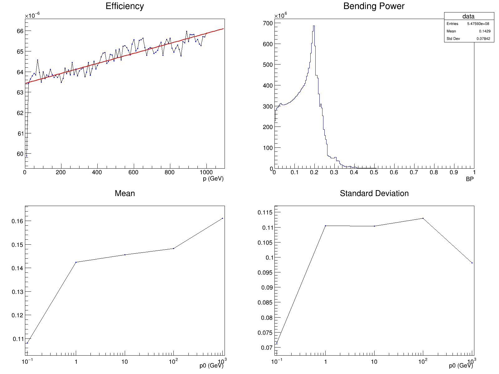

## Magnetic-Spectrometer

A simulation based on the experiment AMS-02, made to study the bending power and efficiency of a spectrometer when hit with an isotropic beam of protons.

Two parameters can be tweaked to play with the resolution of the simulation:

- `N` (initialised in `main.cpp`) - the number of protons generated in the beam
- `h` (initialised in `header.h`) - the resolution used to solve the differential equation in `beam.cpp`

#### The simulation

An extensive description of how the simulation works, and its results, can be found [below](#the-experiment). I used the ROOT library by CERN for random numbers generation and data analysis.

#### How to run

This project was containerized, so you only need Docker to run it. To generate the results in `/output/graph.png`, run `build.sh`. Here's a rundown of what's inside the build file:

- Build and run the image

```
docker build -t redpulp/magnetic-spectrometer .
docker run -d --rm -it --name magnetic-spectrometer redpulp/magnetic-spectrometer
```

- Get the result of the simulation (change the destination path to `%cd%/output/graph.png` if you're using Command Prompt)

```
docker cp magnetic-spectrometer:/src/graph.png ${PWD}/output/graph.png
```

- Kill the container and delete the image

```
docker kill magnetic-spectrometer
docker image rm redpulp/magnetic-spectrometer
```

#### Note of the author

Please note that this project was made in my Uni years, I code better these days, I promise.

## The experiment

This simulation aims to evaluate how the Bending Power of an isotropic magnetic field varies with the initial momentum of the particles that interact with it.

In our case, the particles will be protons beams distibuted as $p^{-3}$, where $p$ is the initial momentum and has 5 values: $0.1$, $1$, $10$, $100$ and $1000$ $GeV$. The particles will be generated from a $3.9m$ sided square, and the detector, will be a cylinder with height and diameter of $1m$, $1.95m$ away from the square.

We will also measure the efficiency of the detector as the squared portion of particles that traverse the whole cylinder.

#### Particles generation

We will generate a random value for the initial momentum and the angle of its trajectory.
Thanks to relativity we know that

$$\frac{\nu}{c} = \beta = \frac{pc}{E} $$

where

$$E = \sqrt{m^2 c^4 + p^2 c^2} $$

In our system we will consider c = 1, q = 1 and m = 1. For this reason:

$$\nu = \frac{p}{1+p^2} $$
We can get the velocity's 3D vector components as

$$
\begin{aligned}
& \nu_{x} = \nu * cos(\phi)\sqrt{1-cos^2(\theta)} \\
& \nu_{y} = \nu * sin(\phi)\sqrt{1-cos^2(\theta)} \\
& \nu_{z} = \nu * \phi \sqrt(cos^2(\theta))
\end{aligned}
$$

Where $0 \lt \theta \lt 2\pi$

#### Motion integration

Given the following system

$$
\left\lbrace \begin{array}{l}
\dot{\nu}_x = \nu_y B_z - \nu_z B_y\\
\dot{\nu}_y = \nu_z B_x - \nu_x B_z\\
\dot{\nu}_z = \nu_x B_y - \nu_y B_x
\end{array}\right.
$$

we can use the Midpoint method to calculate the velocity components, which are interdependent. This method gives us an error of $O(h^3)$, where $h$ is the resolution used to solve the differential equation.

So, given the following equation to describe the position variation

$$\frac{dy_i}{dt} = f(t, y_1 ... y_n)$$

We can update the components with the following formula

$$y_{n+1} = y_n + hf(x_n + \frac{h}{2}f(x_n, y_n), y_n + \frac{h}{2}f(x_n, y_n))$$

#### Bending Power

The Bending Power is defined as

$$\Delta p = \sqrt{\Delta p^2_x + \Delta p^2_y + \Delta p^2_z}$$

where

$$
\begin{aligned}
& \Delta p_x = q(\int B_z dy - \int B_y dz) \\
& \Delta p_y = q(\int B_x dz - \int B_z dx) \\
& \Delta p_z = q(\int B_y dx - \int B_x dy)
\end{aligned}
$$

With a conservative field that is independent from the position, we can calculate the integrals with B as fixed and the extremes of the particles' trajectory as the extremes of integration.

#### Results

Given a beam of $10^9$ protons, the distributions are plotted as follows:



The Bending Power values grows exponentially until it reaches a peak around 1.8, after which it's strong enough to divert the protons out of the detector before hitting the collector at the base, hence the quick decrease of occurrences.

The efficiency of the detector grows linearly with the initial momentum of the particles, which have a lower probability of having their trajectory bent out of the cylinder the faster they pass through it.
